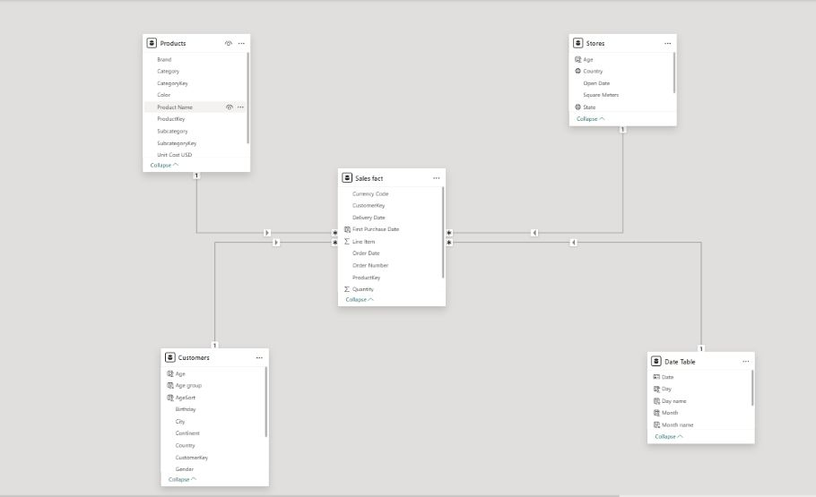
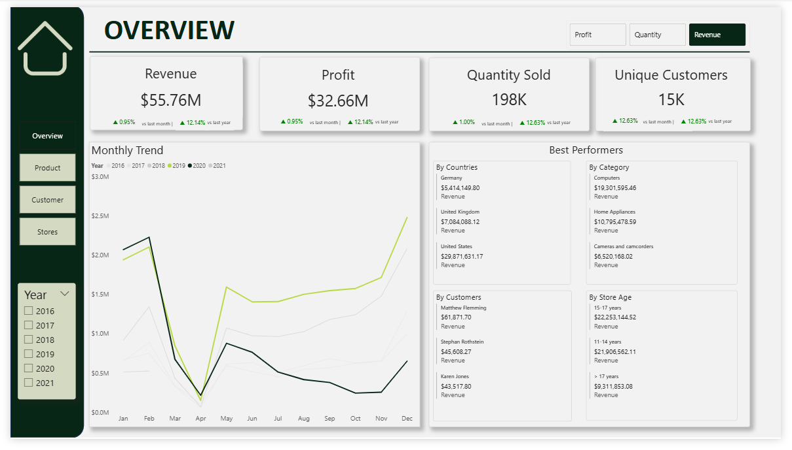
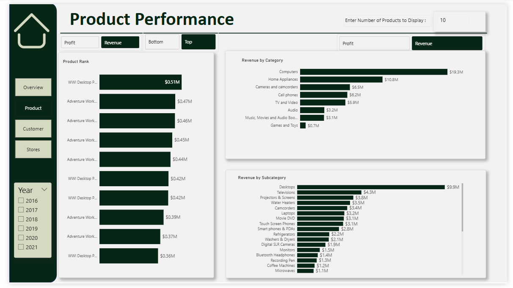
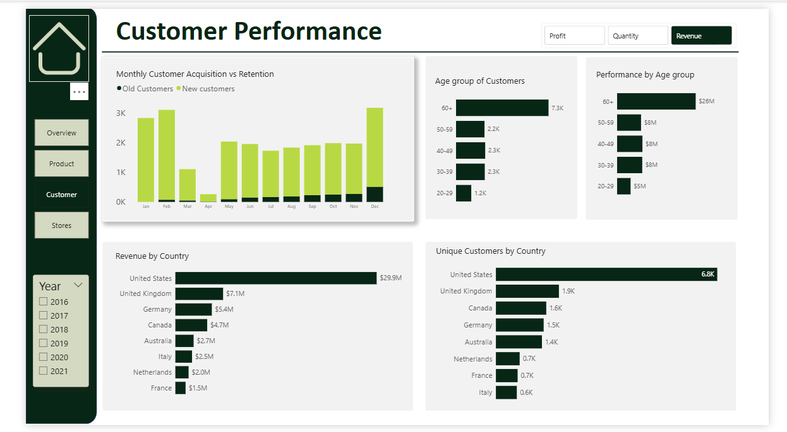

# Global-Electronics-Retail-Report
A Power BI report analyzing global electronics retail data, covering sales performance, customer segmentation, and regional insights through interactive dashboards and DAX calculations.

## Executive Summary
Maven Electronic Global retailer sells electronic gadgets through both online and in-store channels.
The company lacked a unified view of performance across sales channels, product, regions and customer demographics.
A Sales performance dashboard was created to consolidate and analyze sales, product, customers and stores data. The dashboard tracked key performance metrics, uncovered sales trend and provided actionable insights for management to make data-driven decision.

## Project Overview
The Project analyzed revenue and profit performance across multiple retail stores to uncover factors influencing sales growth, product performance, customer segment and store performance.
The analysis integrated sales data, product performance, customer performance metrics and key performance indicators to provide stakeholders with actionable insights for strategic decision making.

## The Data Model Overview
The dataset consists of multiple related tables: 
- Sales: Contains transactional data including orders, delivery dates, quantities, currency, and links to customers, stores, and products. 
- Customers: Provides customer demographics (gender, age, location) to analyze customer behavior and segmentation. 
- Products: Includes product details (brand, color, subcategory, category, unit cost, and unit price) for product performance and profitability analysis. 
- Stores: Provides store-level details (location, size, and open date) to assess regional and store performance. 
- Exchange Rates (Supporting Table): Provides conversion rates by date and currency to ensure consistent reporting in USD.

## Problem Statement
The stakeholders sought to address critical challenges such as:
- Overall KPI tracking such as revenue, profit, quantity sold and number of unique customers.
- Trend of the KPIs over time with interest in growth/decline rate
- Products, categories and Subcategories driving revenue and profit growth/decline
- Customer segment contributing most to revenue and profit. 
- Customer acquisition vs retention
- What stores, state and countries are performing well vs declining
- How stores performance vary based on age of stores.

## Tools and Methodology
Power BI was used for the project.
### Data Cleaning and preparation
The data was cleaned with Power query. To improve data quality and reliability, the following was done:
- Data types were correctly formatted
- The data was screened for duplicates
- Missing values were handled.
### Data Transformation and Processing
To support deeper analysis, several transformation were applied;
- Creation and calculation of customer age from the customer birth date 
- Creation and calculation of store age from open date 
- Categorization of customers into age groups
- Categorization of stores into age bins

### Calculated Fields and Dax measures
Within Power BI environment, calculated metrics were developed to quantify performance including;
- Total Revenue
- Total Profit
- Total Quantity Sold
- Unique Customers
- Growth rate of KPIs using Time Intelligence functions
- KPI parameter
- Top N parameter
- Ranking Parameter
- Customer Acquisition and Retention metrics
DAX measures were used to dynamically compute KPIs across time periods, products, customer segment and stores enabling interactive dashboard analysis.

### Data validation
Cross checks were conducted to ensure:
- KPI outputs were consistent across filters and segments
- Revenue/Profit totals matched transactional aggregates
This validation process ensured analytical integrity.
### Data Modelling
A relational data model was designed using a star schema to link the sales, customer, product and stores table.
A date table was created and linked to the Sales table to enable time intelligence calculations.

### Data Visualization
A four paged interactive dashboard was built. The dashboard answered the stakeholders questions in detail.
Interactive dashboards were developed to present:
- Overview of KPIs showing Growth rate, monthly trend and summary of top 3 best performers across customer segment, product, countries and stores.
- Product performance by category and subcategories
- Customer performance by age group and country
- Monthly Customer Acquisition vs Retention
- Stores performance by age group, country, states
### Dasboard preview
  
 

## Key Insights
- The business generated $55.76M in revenue and $32.66M in profit, representing an approximate 58.6% profit margin, with 198K units sold to 15K unique customers. Sales trends indicate a significant dip around April followed by steady recovery, with peak performance in December, suggesting strong seasonal demand toward the end of the year.
- Revenue is Highly Concentrated in the United States. Analysis of revenue by country shows that the United States generates approximately 53.58% of revenue, significantly outperforming other markets. This indicates that a large portion of total sales is concentrated in the U.S. market.
- Mature Stores Generate Significantly Higher Revenue. Stores that have been operating for 11–17 years generate approximately 79.2% of revenue, while newer stores operating for less than 10 years generate only about 4.1% of revenue. This indicates that store maturity plays a major role in revenue generation, likely due to stronger customer loyalty and established market presence.
- Customer Acquisition appears stronger than Customer Retention. The monthly customer analysis shows that new customers consistently outnumber existing customers across all months, indicating that the business relies heavily on new customers rather than old retained customers.
- Older Customer Segments Contribute the Most Revenue. Customer demographic analysis shows that the 60+ age group represents the largest customer segment with approximately 47.2% of customers. This group also generates the highest revenue contribution, estimated at around $23M.
- Revenue is Driven by a few high-performing Product Categories. Product performance analysis shows that the Computers category generates approximately 34.62% of revenue, making it the highest-performing category. While games and toys categories contribute significantly less with 1.3% of revenue

## Recommendation
- The business should leverage seasonal demand during peak months, prioritize high-performing product categories such as computers, strengthen customer retention strategies for high-value customers, and expand operations in top-performing markets.
- There should be continued strengthening of business presence in the United States by expanding store locations in high-performing states and increasing targeted marketing efforts to capitalize on the strong customer base. 
- Operational strategies and successful practices used by mature stores should be replicated (such as store layout, product assortment, and local marketing strategies) in newer locations to accelerate their revenue growth.
- Investments should be geared towards customer retention initiatives such as loyalty programs, personalized promotions, and customer engagement strategies. At the same time, targeted marketing campaigns should be introduced to attract new customers and support long-term growth.
- Marketing strategies should prioritize high-value customer segments by offering tailored promotions and product recommendations that align with their purchasing behavior. Additionally, targeted campaigns could be developed to attract younger demographics to diversify the customer base.
- There should be prioritization of inventory availability, promotions, and marketing for high-performing product categories. Expanding product lines within these categories may further increase revenue.
- Management should investigate the characteristics of high-performing states—such as demographics, purchasing patterns, or product demand—and apply these strategies in underperforming regions to improve overall geographic performance.

## Conclusion
This analysis delivers a comprehensive evaluation of KPI performance, product performance, customer performance, and store performance. By leveraging data-driven insights to guide strategic decisions, the company can optimize profitability, improve the overall customer experience, and drive sustainable long-term growth.
